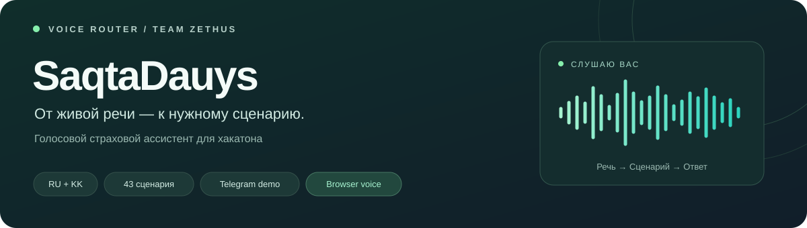
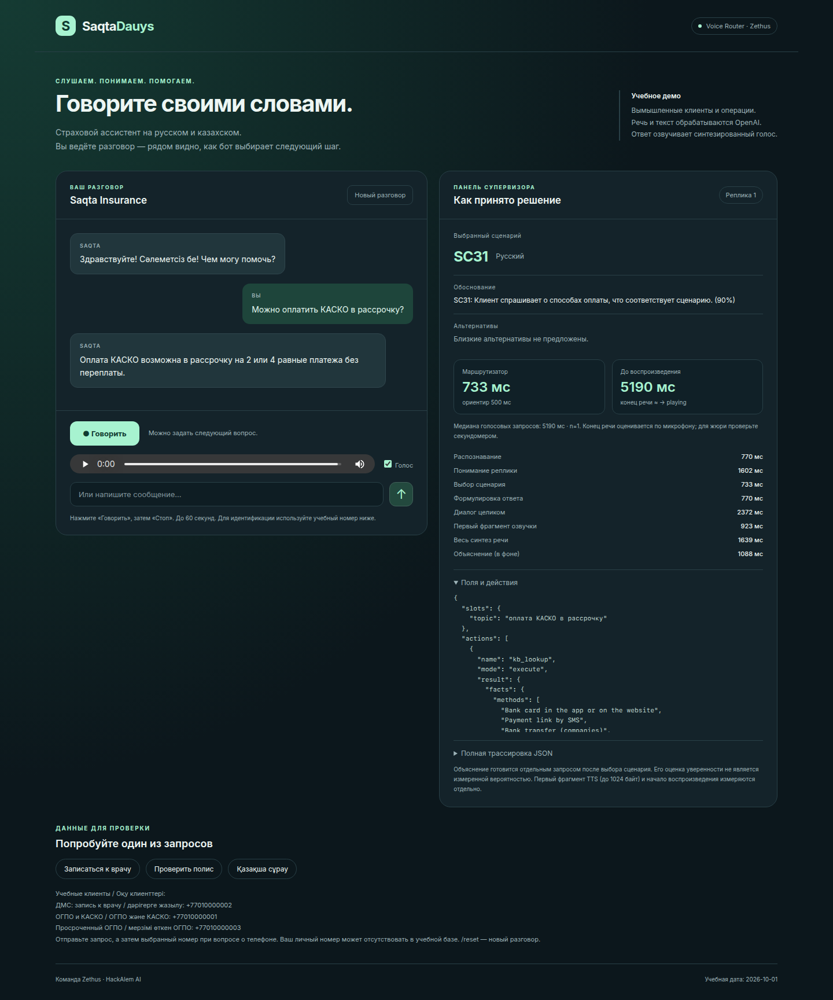
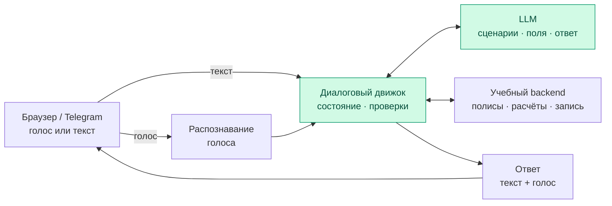

<p align="center">
  <strong>Страховой ассистент, с которым можно говорить своими словами.</strong><br>
  Хакатонный прототип для кейса Voice Router · Saqta Insurance
</p>
<p align="center">
  <a href="#быстрый-старт">Запустить</a> ·
  <a href="docs/DEMO.md">Показать жюри</a> ·
  <a href="#как-это-работает">Архитектура</a> ·
  <a href="#результаты-и-проверки">Результаты</a>
</p>

## Что мы делаем

«Запишите меня к лору. И ещё скажите, покроет ли страховка лекарства» — в одной
реплике уже две просьбы. Клиент может передумать, сменить язык или вернуться
к предыдущему вопросу. Голосовому роботу нужно понимать такой разговор и выбирать
подходящий сценарий обслуживания.

**SaqtaDauys** соединяет LLM-маршрутизатор с диалоговым движком на Python.
Модель разбирает речь и выбирает намерения; движок уточняет данные, проверяет полис,
ведёт очередь вопросов и запрашивает подтверждение перед действием.
Основное демо — микрофон и голосовой ответ в браузере, рядом панель супервизора.
Также доступны Telegram-бот и текстовый чат в терминале.

| Языки | Каталог | Демо | Проверки |
|---|---|---|---|
| Русский, казахский, смешанная речь | 40 бизнес-сценариев + 3 системных | Браузер и Telegram | 119 автоматических тестов |

> **Статус: хакатонный прототип.** Клиенты, полисы и операции учебные.
> Результат маршрутизации на dev-наборе — 100%; свободный диалог ещё требует доработки.

## Что можно попробовать

| Реплика клиента | Что демонстрирует |
|---|---|
| «Проверьте, действует ли мой полис ОГПО» | Поиск клиента, выбор полиса и проверку срока. |
| «Хочу записаться к лору завтра в Астане по ДМС» | Сбор данных и запись после подтверждения. |
| «Проверьте полис и измените почту на demo@mail.example» | Несколько просьб в одном сообщении. |
| «А сначала скажите адрес офиса в Алматы» | Смену темы с сохранением незавершённой задачи. |
| «ДМС полисімнің мерзімін тексеріңізші» | Обращение на казахском языке. |

## Быстрый старт

Нужны **Python 3.10+**, интернет и ключ OpenAI API.
Для браузера и текстового чата достаточно ключа OpenAI; токен нужен только Telegram.
Команды ниже выполняются из корня проекта.

### 1. Подготовить окружение

```bash
python -m venv .venv
source .venv/bin/activate
python -m pip install -r requirements.txt
```

Если `.env` ещё нет, скопируйте шаблон:

```bash
cp -n .env.example .env
```

Заполните файл своими значениями. Существующие ключи менять не нужно.

```dotenv
OPENAI_API_KEY=ваш_ключ_OpenAI
TELEGRAM_BOT_TOKEN=токен_от_BotFather
TELEGRAM_ALLOWED_USER_IDS=
```

Токен Telegram выдаёт [@BotFather](https://t.me/BotFather) по команде `/newbot`.
Пустой `TELEGRAM_ALLOWED_USER_IDS` разрешает доступ всем, кто напишет боту.
Чтобы оставить доступ команде, узнайте ID через `/id`, перечислите их через запятую
и перезапустите процесс. Файл `.env` исключён из Git.

<details>
<summary>Команды для Windows PowerShell</summary>

```powershell
python -m venv .venv
.venv\Scripts\Activate.ps1
python -m pip install -r requirements.txt
if (!(Test-Path .env)) { Copy-Item .env.example .env }
```

</details>

### 2. Открыть голосовое веб-демо

```bash
python src/web_demo.py
```

Откройте **http://localhost:8000**, разрешите микрофон и нажмите **«Говорить»**.
После реплики нажмите **«Стоп»**. Ответ прозвучит в браузере; справа появятся
сценарий, объяснение, альтернативы, поля, действия и время этапов.
Если браузер запретил автоматическое воспроизведение, нажмите ▶ на плеере.
Для другого порта: `python src/web_demo.py --port 8080`.

Объяснение готовится отдельным фоновым запросом и не меняет выбранные сценарии.
Его оценка уверенности не является калиброванной вероятностью.
Текстовый ввод пригодится для учебного телефона или при ошибке распознавания.

<details>
<summary>Как выглядит веб-демо</summary>



</details>

<details>
<summary>Дополнительно: Telegram-бот с QR для жюри</summary>

```bash
python src/telegram_bot.py
```

В терминале появятся **ссылка и QR-код** — жюри сможет открыть бота камерой телефона.
Адрес определяется автоматически через `getMe` для токена из `.env`: при запуске
другого бота QR тоже изменится. QR создаётся локально библиотекой
[Segno](https://segno.readthedocs.io/en/latest/api.html#segno.QRCode.terminal).
Если терминал не поддерживает символы QR, останется обычная ссылка.

Откройте бота по QR или ссылке, нажмите **Start** и отправьте «Здравствуйте»
голосовым сообщением. Бот покажет распознанный текст и ответит текстом и голосом.
Оставьте терминал открытым; остановка — `Ctrl+C`. После изменения кода нужен перезапуск.
Домен и публичный сервер для этого демо не требуются: используется long polling.
Запускайте один процесс на токен; для бота с существующим webhook создайте отдельного демо-бота.

</details>

### 3. Провести первый разговор

В браузере нажмите **«Новый разговор»**; в Telegram отправьте `/reset` и `/demo`.
Отправляйте по одной реплике и дожидайтесь ответа:

```text
Хочу записаться к лору завтра в Астане по ДМС.
+77010000002
Да.
```

«Да» отправьте после предложения подтвердить запись. Телефон удобно вводить текстом;
остальные реплики можно произнести. В учебной базе «сегодня» — **1 октября 2026**,
поэтому «завтра» означает **2 октября**.

| Учебный телефон | Для чего подходит |
|---|---|
| `+77010000002` | ДМС: запись к врачу и вопросы о покрытии. |
| `+77010000001` | Действующие ОГПО и КАСКО. |
| `+77010000003` | Проверка просроченного ОГПО. |

Личный номер может отсутствовать в учебной базе. «Новый разговор» в браузере
или `/reset` в Telegram возвращает исходные данные. Готовый план выступления — **[демо за 3–4 минуты](docs/DEMO.md)**.

<details>
<summary>Команды Telegram-бота</summary>

| Команда | Действие |
|---|---|
| `/demo` | Показать учебных клиентов. |
| `/reset` | Сбросить разговор и изменения учебной базы. |
| `/voice_on` · `/voice_off` | Включить или выключить голосовые ответы. |
| `/trace_on` · `/trace_off` | Показать или скрыть файлы трассировки. |
| `/id` | Узнать свой Telegram ID для списка доступа. |
| `/help` | Открыть справку. |

</details>

## Как это работает



LLM получает каталог сценариев, контекст и факты. Python проверяет допустимые ID,
формат данных, принадлежность полиса и подтверждение операции. На новом запросе
маршрутизация и извлечение полей выполняются параллельно; действия — последовательно.
В браузер озвучка передаётся потоком. При смене темы
незавершённая задача сохраняется; у каждого пользователя свой сеанс.

| Этап | Модель |
|---|---|
| Выбор сценария и диалог | `gpt-4o-mini` |
| Распознавание голосового сообщения | `gpt-4o-mini-transcribe` |
| Диктовка телефона или ИИН | `gpt-4o-transcribe` |
| Голосовой ответ | `gpt-4o-mini-tts`, голос `coral` |

Подробнее: **[карта модулей, состояние и подтверждения](docs/ARCHITECTURE.md)**.

## Результаты и проверки

Сохранённый [`predictions.json`](predictions.json) проверен на **104 репликах**
открытого dev-набора. Для сравнения приведены результаты первого прогона:

| Метрика | Исходный промпт | Уточнённый промпт |
|---|---:|---:|
| Верный первый сценарий | 98 / 104 · 94,2% | **104 / 104 · 100%** |
| Полное совпадение набора сценариев | 96 / 104 · 92,3% | **104 / 104 · 100%** |
| Полнота намерений в составных запросах | 96,2% | **100%** |

**Промпт дорабатывался по этому набору.** Результат на скрытых данных пока неизвестен.
Эта оценка относится к маршрутизации текста; она не измеряет распознавание голоса
или качество всего диалога. В свободных разговорах ещё встречаются ошибки сумм,
языка ответа и продолжения предыдущего запроса.

Свежий независимый вызов текущего маршрутизатора тоже дал **104/104**:
[отчёт проверки](docs/measurements/router-audit.json). Сохранённый `predictions.json`
при аудите не перезаписывался.

Проверить сохранённые результаты и запустить тесты **без внешних API и ключа**
(HTTP-тесты используют локальный loopback):

```bash
python data/evaluate.py predictions.json data/dev_utterances.json
python -m unittest discover -s tests -v
```

119 тестов проверяют загрузку данных, ответы маршрутизатора, переходы диалога,
подтверждения, разбор номеров, Telegram и QR, изоляцию веб-сеансов, потоковую
передачу аудио и независимость объяснений от выбора сценария.
Внешние API в них подменены. Отдельно проверен живой диалог ДТП: сообщение
о погибшем заполняет признак пострадавших, короткий адрес сохраняется дословно,
бот сообщает о необходимости экстренного обращения и учебном характере передачи.

<details>
<summary>Текстовый чат, повторяемые диалоги и новый прогон маршрутизатора</summary>

Эти команды обращаются к OpenAI и расходуют API-квоту:

```bash
# Интерактивный чат с трассировкой
python src/chat_demo.py --trace

# Диалоги из файлов
python src/chat_demo.py --script examples/chat_demo.json --trace
python src/chat_demo.py --script examples/dialog_regression.json --trace
python src/chat_demo.py --script examples/handoff_regression.json --trace
python src/chat_demo.py --script examples/accident_regression.json --trace

# Заново классифицировать dev-набор и заменить predictions.json
python src/main_router.py
python data/evaluate.py predictions.json data/dev_utterances.json
```

Команды внутри текстового чата: `/demo`, `/reset`, `/state`, `/quit`.
После нового прогона метрики нужно пересчитать.

</details>

## Задержка: что измерено

На пяти запросах, повторённых дважды в обоих режимах, медиана обработки диалога
снизилась **с 2566,5 до 1559,5 мс — на 39,2%**. Все 10 пар сохранили выбранные
сценарии. Это время диалога **без STT, TTS и воспроизведения**.

Полный голосовой smoke-тест с настоящим OpenAI API и синтетическим голосом дал
**5190 мс от оценённого конца речи до события `playing` в Chromium**;
сам маршрутизатор занял 733 мс. Это один замер, не репрезентативная медиана.
**Ориентиры 500 мс / 1,5 с пока не достигнуты.** По PDF они дают бонус за скорость
и не являются условием сдачи.

[Методика, сырые замеры и повторный запуск](docs/LATENCY.md) ·
[Сверка с техническим заданием PDF](docs/REQUIREMENTS.md)

## Границы демо

- **Исполнение сценариев.** Для 33 бизнес-сценариев есть обработчики.
  `SC02`, `SC04`, `SC05`, `SC06`, `SC12`, `SC27`, `SC28` передаются оператору в демо.
  Полное оформление всех продуктов ещё не реализовано.
- **Учебные операции.** Записи, обращения и изменения контактов хранятся в памяти.
  Реальные полисы, SMS и письма не отправляются; живой оператор не подключается.
  Расписание клиник сгенерировано для демонстрации.
- **Голосовые сообщения.** Записи до 60 секунд и 10 МБ. Телефонные звонки,
  непрерывный разговор и перебивание бота пока не реализованы.
- **Качество и скорость.** При ошибке распознавания можно отправить текст.
  Браузер оценивает конец речи по энергии микрофона и измеряет начало воспроизведения.
  Для оценки жюри нужна серия живых реплик и контроль секундомером. Telegram
  не сообщает момент первого звука на телефоне; эта метрика там остаётся пустой.
- **Локальный сервер.** Веб-демо слушает только `127.0.0.1`; оно предназначено
  для запуска на ноутбуке. Публичный хостинг, телефония и промышленная авторизация
  не настроены. Chromium проверен; другие браузеры требуют отдельной проверки.

Текст, короткая история и аудио обрабатываются OpenAI; при использовании Telegram
сообщения также остаются в чате. Используйте синтетические данные из комплекта.
Аудио приложения хранится в памяти. В `.runtime/` сохраняются номер обновления
Telegram и отчёты, если запускать диагностику. Идентификация по телефону упрощена.
Внутри одного сеанса реплики обрабатываются последовательно; сеанс сбрасывается
после часа простоя или перезапуска.

## Где что лежит

```text
src/
├── main_router.py      # Пакетная маршрутизация → predictions.json
├── chat_demo.py        # Разговор в терминале
├── web_demo.py         # Локальный HTTP-сервер и голосовой API
├── web/                # Микрофон, плеер и панель супервизора
├── telegram_bot.py     # Telegram и QR текущего бота
├── benchmark.py        # Парные замеры диалога через настоящий API
├── config.py           # Модели, пути и лимиты
├── agent/              # Состояние, каталог и управление диалогом
└── tools/              # Учебный backend, аудио и Telegram API
data/                   # Материалы кейса и оценщик
examples/               # Реплики для повторяемых прогонов
tests/                  # Проверки без внешних API
docs/                   # Архитектура и сценарий выступления
```

Для работы с кодом:

```bash
python -m pip install -r requirements-dev.txt
ruff check src tests
ruff format --check src tests
```

Общий стиль задан в [`pyproject.toml`](pyproject.toml).
Применить форматирование: `ruff format src tests`.

---

**Команда Zethus · Voice Router**

[Материалы кейса](data/README.md) · [Қазақша сипаттама](data/README.kz.md) ·
[План демонстрации](docs/DEMO.md) · [Архитектура](docs/ARCHITECTURE.md)
